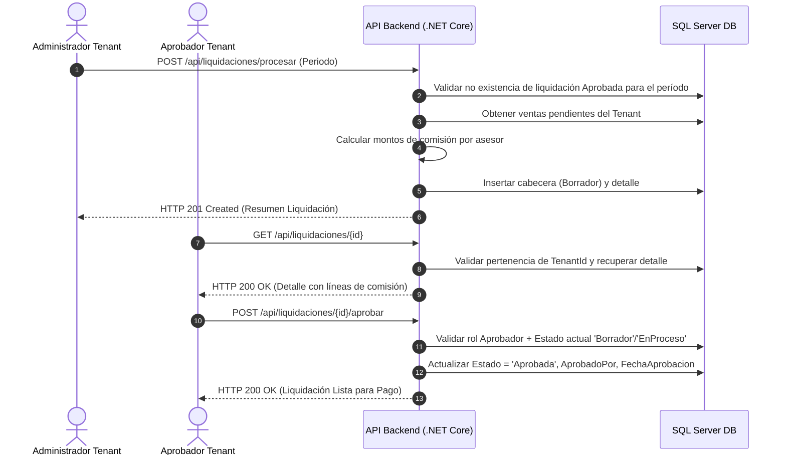

# Punto 1: Análisis y Especificación

## 1.1 Preguntas de Refinamiento al Product Owner (8 pts)

Las siguientes preguntas están diseñadas para clarificar reglas de negocio, manejo de excepciones, seguridad y requisitos de auditoría para la User Story **US-042 (Módulo de Liquidación Automática de Comisiones)** antes de iniciar la codificación:

1. **Variación de Reglas de Comisión:** ¿Cómo varía la estructura de comisiones entre un asesor y otro dentro del mismo tenant? ¿Existen reglas dinámicas por categoría/sector (seguros, retail, automotriz) o se maneja una tasa/fórmula fija preconfigurada en el perfil del asesor?
2. **Tratamiento de Errores Post-Aprobación:** ¿Qué procedimiento de negocio debe ejecutarse si se identifica un error en los datos fuente (ej. una venta cancelada o una devolución) después de que la liquidación ha sido marcada como `Aprobada`? ¿El sistema debe permitir reliquidaciones/ajustes en el período actual o se genera un saldo compensatorio en el siguiente período?
3. **Control de Acceso y Segregación de Funciones:** ¿Quiénes exactamente dentro del tenant tienen permisos para visualización, cuáles para iniciar el cálculo y quiénes pueden aprobar las liquidaciones? ¿Un usuario con rol `Admin` puede aprobar sus propias liquidaciones iniciadas o se requiere separación estricta de deberes (*Segregation of Duties*)?
4. **Requisitos de Auditoría y Trazabilidad:** ¿Qué información exacta debe quedar registrada en los logs de auditoría ante cada cambio de estado (ej. inicio de cálculo, aprobación, rechazo)? ¿Se requiere almacenar el snapshot completo de las reglas aplicadas en el momento del cálculo para eventuales revisiones fiscales/contables?
5. **Cierre de Período y Ventas Retroactivas:** ¿Qué define el "cierre de período" y cómo maneja el sistema las ventas registradas con fecha retroactiva? Si ingresa una venta correspondiente a un mes ya liquidado, ¿se bloquea la ingesta o entra a la liquidación del mes subsiguiente?
6. **Manejo de Montos Nulos o Negativos:** ¿Cómo debe actuar el cálculo cuando un asesor tiene comisiones acumuladas en \$0 o montos negativos (por contracargos/devoluciones)? ¿Se incluye en el listado de liquidación con saldo \$0 / saldo en contra o se excluye del proceso?
7. **Integración con Sistemas de Dispersión/Pago:** Al cambiar el estado de la liquidación a `Aprobada`, ¿el sistema debe enviar automáticamente una instrucción de pago (API/Fisapay) o este proceso de dispersión financiera ocurre en un sistema externo fuera del alcance del sprint?

---

## 1.2 Especificación Técnica (12 pts)

### Supuestos del Sistema
- **Plataforma Multi-tenant:** Credilike funciona bajo un esquema multi-tenant donde cada cliente (`TenantId`) aísla sus datos lógicamente.
- **Ciclo de Vida de la Liquidación:** Transita por los estados: `Borrador` $\rightarrow$ `EnProceso` $\rightarrow$ `Aprobada` (o `Rechazada`).
- **Inmutabilidad:** Una vez que una liquidación pasa a estado `Aprobada`, no puede ser modificada ni recalculada por ningún rol.

---

### Alcance (Scope)

#### Dentro del Alcance (IN SCOPE)
- Cálculo automático de comisiones por `TenantId` y `Periodo` basándose en las ventas cerradas pendientes de liquidar.
- Creación de registros de cabecera (`Liquidaciones`) y su detalle por asesor (`LiquidacionDetalles`).
- Endpoints REST para:
  - Iniciar proceso de liquidación (`POST /api/liquidaciones/procesar`).
  - Consultar detalle de una liquidación (`GET /api/liquidaciones/{id}`).
  - Aprobar liquidación y marcarla lista para pago (`POST /api/liquidaciones/{id}/aprobar`).
- Restricción de acceso estricta por roles (`Admin`, `Supervisor`, `Aprobador`) y aislamiento de datos por `TenantId`.
- Estructura estándar de respuestas JSON y manejo de errores uniformes.

#### Fuera del Alcance (OUT OF SCOPE)
- Dispersión bancaria sincrónica o ejecución directa de transferencias monetarias.
- Edición manual de montos individuales de comisiones por UI en este sprint.
- Generación de reportes exportables en Excel / PDF.

---

### Flujo Básico del Proceso



---

### Modelo de Entidades Afectadas/Nuevas

#### `Liquidaciones` (Cabecera)
| Campo | Tipo de Dato | Restricción | Descripción |
| :--- | :--- | :--- | :--- |
| `Id` | `INT` | PK, IDENTITY | Identificador único de la liquidación |
| `TenantId` | `INT` | FK, NOT NULL | Identificador del cliente / empresa |
| `Periodo` | `VARCHAR(7)` | NOT NULL | Período de liquidación (ej. "2026-08") |
| `MontoTotal` | `DECIMAL(18,2)` | NOT NULL | Suma total de comisiones calculadas |
| `TotalAsesores` | `INT` | NOT NULL | Cantidad de asesores incluidos |
| `Estado` | `VARCHAR(20)` | NOT NULL | Estado: 'Borrador', 'EnProceso', 'Aprobada', 'Rechazada' |
| `CreatedAt` | `DATETIME2` | NOT NULL | Fecha de creación del registro |
| `CreatedBy` | `INT` | FK, NOT NULL | Usuario Admin que inició el proceso |
| `AprobadoPor` | `INT` | FK, NULLABLE | Usuario Aprobador (si aplica) |
| `FechaAprobacion` | `DATETIME2` | NULLABLE | Fecha/hora en que fue aprobada |

#### `LiquidacionDetalles` (Líneas por Asesor)
| Campo | Tipo de Dato | Restricción | Descripción |
| :--- | :--- | :--- | :--- |
| `Id` | `INT` | PK, IDENTITY | Identificador de la línea |
| `TenantId` | `INT` | FK, NOT NULL | Identificador del tenant para aislamiento |
| `LiquidacionId` | `INT` | FK, NOT NULL | Referencia a la cabecera `Liquidaciones` |
| `AsesorId` | `INT` | FK, NOT NULL | Identificador del usuario asesor |
| `MontoVentas` | `DECIMAL(18,2)` | NOT NULL | Monto total de ventas base del período |
| `MontoComision` | `DECIMAL(18,2)` | NOT NULL | Monto resultante de comisión |
| `Estado` | `VARCHAR(20)` | NOT NULL | Estado individual de la línea |
| `CreatedAt` | `DATETIME2` | NOT NULL | Fecha de creación |
| `CreatedBy` | `INT` | FK, NOT NULL | Usuario creador |

---

### Especificación del Endpoint HTTP Principal

**`POST /api/liquidaciones/procesar`**

- **Descripción:** Inicia el cálculo automático de comisiones para todas las ventas pendientes del período indicado.
- **Seguridad:** Requiere JWT válido con rol `Admin` y concordancia con el `TenantId` del token.
- **Headers:**
  ```http
  Authorization: Bearer <token_jwt>
  Content-Type: application/json
  ```
- **Request Body:**
  ```json
  {
    "periodo": "2026-08",
    "observaciones": "Liquidación automática cierre mensual de agosto"
  }
  ```
- **Response 201 (Created):**
  ```json
  {
    "status": 201,
    "mensaje": "Liquidación procesada exitosamente",
    "data": {
      "id": 1045,
      "tenantId": 12,
      "periodo": "2026-08",
      "montoTotal": 45850000.00,
      "totalAsesores": 128,
      "estado": "Borrador",
      "createdAt": "2026-09-01T15:30:00Z",
      "createdBy": 45
    }
  }
  ```
- **Response 400 (Bad Request / Conflicto de Período):**
  ```json
  {
    "codigo": "LIQ_PERIOD_ALREADY_APPROVED",
    "mensaje": "Ya existe una liquidación aprobada para el período 2026-08",
    "detalle": "No se permite recalcular períodos con liquidaciones finalizadas."
  }
  ```

---

### Criterios de Aceptación (Given-When-Then)

1. **Cálculo Exitoso en Estado Borrador:**
   - **Dado que** un usuario con rol `Admin` autenticado en el Tenant `12` solicita el cálculo para el período `"2026-08"` que no posee liquidaciones previas aprobadas,
   - **Cuando** consume el endpoint `POST /api/liquidaciones/procesar`,
   - **Entonces** el sistema debe procesar las ventas pendientes del Tenant `12`, crear un nuevo registro en la tabla `Liquidaciones` con estado `"Borrador"`, generar sus correspondientes `LiquidacionDetalles` y retornar una respuesta HTTP 201 con el resumen.

2. **Aprobación e Inmutabilidad de Liquidación:**
   - **Dado que** existe una liquidación con `Id = 1045` en estado `"Borrador"` perteneciente al Tenant `12`,
   - **Cuando** un usuario con rol `Aprobador` del Tenant `12` consume el endpoint `POST /api/liquidaciones/1045/aprobar`,
   - **Entonces** el sistema actualiza el estado de la liquidación a `"Aprobada"`, registra el `AprobadoPor` con el ID del usuario actual, establece la `FechaAprobacion` con la hora del servidor, y bloquea cualquier intento posterior de recálculo o modificación.

3. **Aislamiento Multi-Tenant Estricto:**
   - **Dado que** un usuario está autenticado y pertenece únicamente al Tenant `12`,
   - **Cuando** intenta consultar (`GET /api/liquidaciones/999`) o aprobar (`POST /api/liquidaciones/999/aprobar`) una liquidación que pertenece al Tenant `99`,
   - **Entonces** el sistema debe denegar la operación devolviendo un código HTTP 403 Forbidden o 404 Not Found, garantizando que un tenant jamás pueda visualizar o alterar datos de otro cliente.
