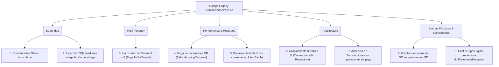

# Ejercicio 2.2: Debugging y Refactoring de LiquidacionService.cs

## 1. Análisis de Problemas Identificados (Clasificación por Categoría)

El fragmento de código analizado presenta **9 problemas significativos** repartidos en 5 categorías fundamentales:



---

### Detalle de Clasificación

| ID | Categoría | Descripción del Problema | Gravedad |
| :-: | :--- | :--- | :-: |
| **1** | **Seguridad** | **Credenciales hardcodeadas en código:** La cadena de conexión expone el usuario administrador `sa` y la contraseña `Admin123;` en texto plano en el repositorio. | 🔴 Crítico |
| **2** | **Seguridad** | **Vulnerabilidad de Inyección SQL:** La consulta `$"SELECT * FROM Comisiones WHERE TenantId = {tenantId}"` interpola variables directamente en lugar de usar parámetros (`SqlParameter`). | 🔴 Crítico |
| **3** | **Multi-tenancy** | **Fuga de datos entre tenants:** En `ProcesarLiquidacion`, se llama a `GetComisiones(0)` con un `tenantId` nulo/hardcodeado en 0, violando el aislamiento lógicamente obligatorio entre clientes SaaS. | 🔴 Crítico |
| **4** | **Performance** | **Fuga de conexiones a BD:** `_conn.Open()` y `cmd.ExecuteReader()` no liberan recursos mediante `using` / `IAsyncDisposable`. Esto agota el *Connection Pool* del servidor rápidamente. | 🟠 Alto |
| **5** | **Arquitectura** | **Acoplamiento directo a ADO.NET / SqlConnection:** Impide realizar pruebas unitarias con Mocks y viola los principios SOLID (Inversión de Dependencias). | 🟠 Alto |
| **6** | **Arquitectura** | **Falta de Manejo Transaccional:** La actualización de montos de comisión en un bucle no cuenta con `SqlTransaction`. Un fallo a mitad del proceso corrompe los saldos financieros. | 🟠 Alto |
| **7** | **Buenas Prácticas** | **Falta de Persistencia:** Las comisiones actualizadas en memoria (`c.Monto = c.Monto * 1.1m;`) nunca se guardan en la base de datos (`// guardar en BD` comentado). | 🟠 Alto |
| **8** | **Buenas Prácticas** | **Cast inseguro de campos NULOS:** `(decimal)reader["Monto"]` lanzará `InvalidCastException` si la columna en la BD contiene un valor `NULL`. | 🟡 Medio |
| **9** | **Performance** | **Falta de operaciones en lote (Batch Update):** Procesar comisiones de una en una dentro de un bucle `foreach` genera cuello de botella (N+1 queries). | 🟡 Medio |

---

## 2. Identificación del Problema Más Crítico

> [!CAUTION]
> **El problema más crítico es la combinación de Credenciales 'sa' expuestas + Inyección SQL + Fuga Multi-tenant.**
> 
> **Justificación Técnica:**
> En un sistema SaaS multi-tenant que gestiona **pagos y dinero de asesores comisionistas**, la combinación de una consulta SQL interpolada con privilegios de superusuario (`sa`) permite a un usuario malintencionado no solo evadir los filtros y extraer/modificar los datos financieros de cualquier otra empresa cliente de la plataforma (violando acuerdos de confidencialidad y normativas GDPR/Habeas Data), sino ejecutar comandos remotos en el sistema operativo del servidor a través de `xp_cmdshell` en SQL Server.

---

## 3. Código Refactorizado y Corregido

A continuación se presenta la versión profesional refactorizada en **C# .NET 8**, implementando arquitectura limpia, patrones `Repository`, inyección de dependencias, parámetros seguros y manejo de transacciones:

```csharp
using System;
using System.Collections.Generic;
using System.Data;
using System.Linq;
using System.Threading.Tasks;
using Microsoft.Data.SqlClient;
using Microsoft.Extensions.Configuration;
using Microsoft.Extensions.Logging;

namespace Credilike.Core.Services
{
    public class ComisionModel
    {
        public int Id { get; set; }
        public int TenantId { get; set; }
        public decimal Monto { get; set; }
        public string Estado { get; set; } = string.Empty;
    }

    /// <summary>
    /// Versión corregida y refactorizada de LiquidacionService.
    /// Resuelve problemas de inyección SQL, seguridad de credenciales, multi-tenancy y rendimiento.
    /// </summary>
    public class LiquidacionServiceRefactored
    {
        private readonly string _connectionString;
        private readonly ILogger<LiquidacionServiceRefactored> _logger;

        // FIX (Arquitectura & Seguridad): La cadena de conexión se inyecta desde IConfiguration 
        // de forma segura (ej. Azure Key Vault / User Secrets), NUNCA hardcodeada.
        public LiquidacionServiceRefactored(IConfiguration configuration, ILogger<LiquidacionServiceRefactored> logger)
        {
            _connectionString = configuration.GetConnectionString("DefaultConnection") 
                ?? throw new InvalidOperationException("Cadena de conexión 'DefaultConnection' no configurada.");
            _logger = logger ?? throw new ArgumentNullException(nameof(logger));
        }

        /// <summary>
        /// Obtiene comisiones de forma segura aplicando filtro estricto de TenantId.
        /// </summary>
        public async Task<List<ComisionModel>> GetComisionesAsync(int tenantId)
        {
            // FIX (Multi-Tenancy & Validación): Garantizar TenantId válido > 0
            if (tenantId <= 0)
            {
                throw new ArgumentException("El TenantId debe ser un identificador válido mayor a 0.", nameof(tenantId));
            }

            var result = new List<ComisionModel>();

            // FIX (Seguridad & Performance): Consulta parametrizada para evitar Inyección SQL.
            // FIX (Recursos): Bloque 'using await' para garantizar la liberación de la conexión.
            const string query = @"
                SELECT Id, TenantId, Monto, Estado 
                FROM Comisiones WITH (NOLOCK) 
                WHERE TenantId = @TenantId AND Estado = @Estado;";

            await using var conn = new SqlConnection(_connectionString);
            await conn.OpenAsync();

            await using var cmd = new SqlCommand(query, conn);
            cmd.Parameters.Add("@TenantId", SqlDbType.Int).Value = tenantId;
            cmd.Parameters.Add("@Estado", SqlDbType.VarChar, 20).Value = "pendiente";

            await using var reader = await cmd.ExecuteReaderAsync();
            while (await reader.ReadAsync())
            {
                // FIX (Buenas Prácticas): Manejo seguro de nulos y casteo defensivo
                result.Add(new ComisionModel
                {
                    Id = reader.GetInt32(reader.GetOrdinal("Id")),
                    TenantId = reader.GetInt32(reader.GetOrdinal("TenantId")),
                    Monto = reader.IsDBNull(reader.GetOrdinal("Monto")) ? 0m : reader.GetDecimal(reader.GetOrdinal("Monto")),
                    Estado = reader.GetString(reader.GetOrdinal("Estado"))
                });
            }

            return result;
        }

        /// <summary>
        /// Procesa la liquidación dentro de una transacción atómica y actualiza los registros en BD.
        /// </summary>
        public async Task ProcesarLiquidacionAsync(int tenantId, decimal factorAjuste = 1.1m)
        {
            // FIX (Multi-Tenancy): Pasar el tenantId real recibido por parámetro, nunca 0.
            var comisiones = await GetComisionesAsync(tenantId);

            if (!comisiones.Any())
            {
                _logger.LogInformation("No se encontraron comisiones pendientes para procesar en el tenant {TenantId}.", tenantId);
                return;
            }

            await using var conn = new SqlConnection(_connectionString);
            await conn.OpenAsync();

            // FIX (Arquitectura & Seguridad): Uso de Transacción explícita para asegurar atomicidad.
            await using var transaction = (SqlTransaction)await conn.BeginTransactionAsync();

            try
            {
                // FIX (Performance & Persistencia): Sentencia UPDATE masiva/parametrizada en BD
                const string updateQuery = @"
                    UPDATE Comisiones 
                    SET Monto = Monto * @Factor, 
                        Estado = 'Procesado',
                        FechaModificacion = GETUTCDATE()
                    WHERE TenantId = @TenantId AND Estado = 'pendiente';";

                await using var cmd = new SqlCommand(updateQuery, conn, transaction);
                cmd.Parameters.Add("@Factor", SqlDbType.Decimal).Value = factorAjuste;
                cmd.Parameters.Add("@TenantId", SqlDbType.Int).Value = tenantId;

                int filasAfectadas = await cmd.ExecuteNonQueryAsync();
                
                // Confirmar transacción
                await transaction.CommitAsync();
                _logger.LogInformation("Liquidación completada exitosamente para tenant {TenantId}. Registros procesados: {Count}", tenantId, filasAfectadas);
            }
            catch (Exception ex)
            {
                // Revertir en caso de error
                await transaction.RollbackAsync();
                _logger.LogError(ex, "Error al procesar la liquidación para el tenant {TenantId}. Transacción revertida.", tenantId);
                throw;
            }
        }
    }
}
```
